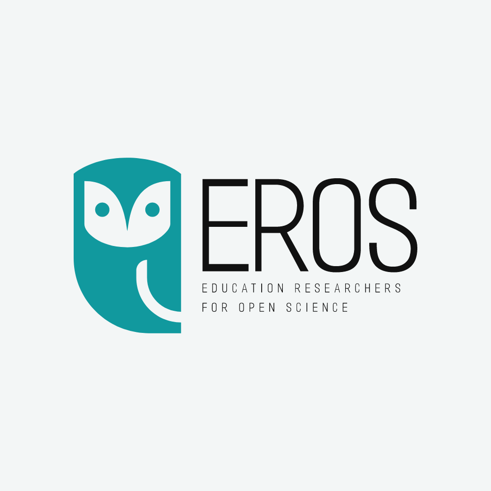

+--------------------------------------------------------------------------------------------------------------------+---------------+
| 00 Introduction                                                                                                    | 9:30 - 9:40   |
|                                                                                                                    |               |
| -   [Slides](https://docs.google.com/presentation/u/0/d/1L7gMWzqfxUl0ZlfAGRLhvuZ8QuI09ll5FEc19Xy_oJA/edit)         |               |
+--------------------------------------------------------------------------------------------------------------------+---------------+
| 01 What to keep and why - data reuses cases and you                                                                | 9:40 - 10:10  |
|                                                                                                                    |               |
| -   [Slides](https://docs.google.com/presentation/u/0/d/1L7gMWzqfxUl0ZlfAGRLhvuZ8QuI09ll5FEc19Xy_oJA/edit)         |               |
|                                                                                                                    |               |
| -   [Activities](https://docs.google.com/document/d/1fmGAk5zZWQMVs0-Pzu4B7WXrDGza4xNEfD5nw9CgmXE/edit?usp=sharing) |               |
+--------------------------------------------------------------------------------------------------------------------+---------------+
| 02 What to share and how - sharing ethically and legally                                                           | 10:15 - 11:00 |
|                                                                                                                    |               |
| -   [Slides](https://docs.google.com/presentation/u/0/d/1L7gMWzqfxUl0ZlfAGRLhvuZ8QuI09ll5FEc19Xy_oJA/edit)         |               |
|                                                                                                                    |               |
| -   [Activities](https://docs.google.com/document/d/1o8Moy64i12mbyLVpx4i4gPaKDOKfx9d34_X9iVBeyWQ/edit?usp=sharing) |               |
+--------------------------------------------------------------------------------------------------------------------+---------------+
| 03 Avoiding zombie data - FAIR to the rescue                                                                       | 11:15 - 12:00 |
|                                                                                                                    |               |
| -   [Slides](https://docs.google.com/presentation/u/0/d/1L7gMWzqfxUl0ZlfAGRLhvuZ8QuI09ll5FEc19Xy_oJA/edit)         |               |
|                                                                                                                    |               |
| -   [Activities](https://docs.google.com/document/d/1M8EN49CY9MxlJEDJfkJgB1ZeHI_bA7ClDxZUPxiOjyQ/edit?usp=sharing) |               |
+--------------------------------------------------------------------------------------------------------------------+---------------+
|                                                                                                                    |               |
+--------------------------------------------------------------------------------------------------------------------+---------------+

{width="30%"} **For more info, contact: [cylcia.bolibaugh\@york.ac.uk](mailto:cylcia.bolibaugh@york.ac.uk){.email}**
